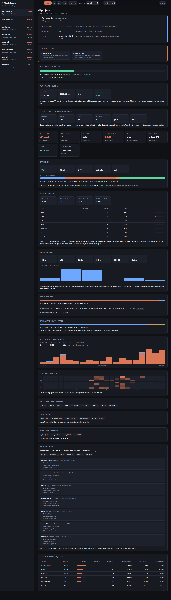
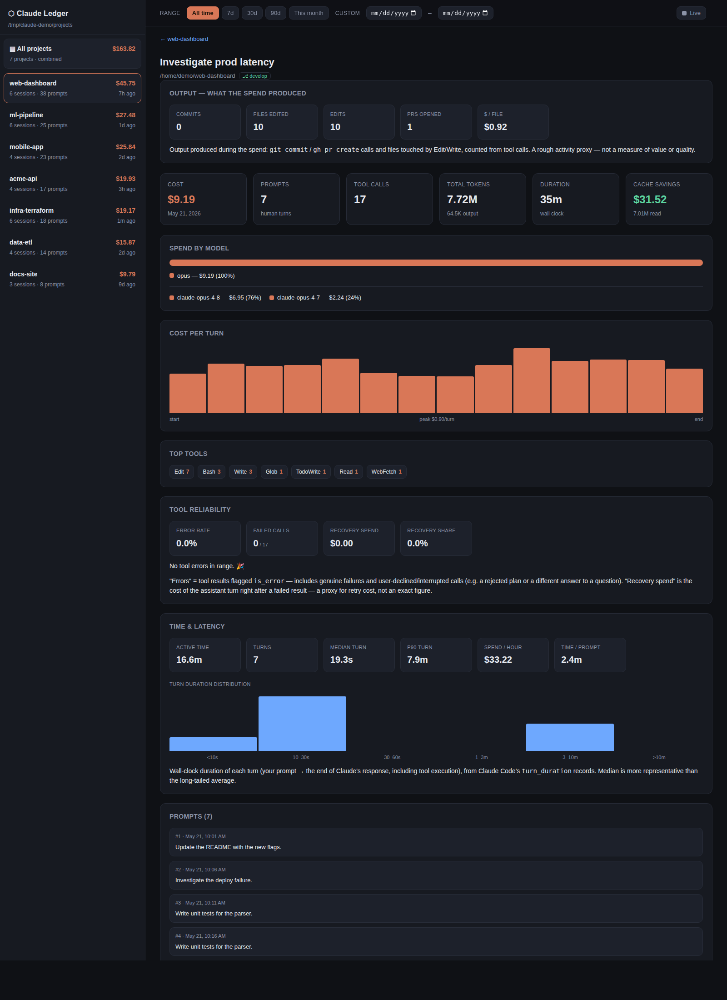

# Claude Ledger

A zero-dependency cost / ROI analyzer for [Claude Code](https://claude.com/claude-code) projects.

It reads the session transcripts under `~/.claude/projects`, attributes token usage
to per-model pricing, and serves a small web dashboard where you can pick a project
(or view all at once) and see what it actually cost — with a glanceable
**"is the AI paying off?"** verdict up top before the detail.



<sub>Screenshot uses synthetic demo data.</sub>



<sub>A single session, deep-linked via <code>?project=…&session=…</code>.</sub>

## Features

- **"Is it paying off?" verdict** — the bottom line, up top: a glanceable
  good / ok / watch read on whether the AI returns your investment, shown above
  everything else on the All-projects view. It grades only what's honestly
  observable — **value for money** (your range's API-equivalent usage vs your
  monthly plan fee, prorated to the range), **efficiency** (cache reuse + retry /
  friction spend), and **direction** (is spend efficiency improving vs the prior
  period) — and shows **output** (commits / files) *without* grading it, because
  whether the work was meaningful is your call, not the tool's. Set `planMonthlyFee`
  to unlock the value-for-money grade.
- **"Worth a look" signals** — a ranked panel at the top of each view that surfaces
  what actually stands out in the selected range: a spend spike, a pricey session,
  concentrated spend, recovery/friction cost, a big trend vs the prior period, heavy
  automation, an unrecognized model, or a slow-turn latency tail. Purely descriptive
  (it points; it doesn't prescribe), ranked by dollar impact, and shown only when
  something genuinely stands out — so the dashboard leads with signal instead of
  fifteen equally-weighted panels.
- **"What you built" work log** — the accomplishment side of ROI: a per-range
  summary of commits, PRs, files, the sessions worked on, and recurring title
  words, with a one-click **Markdown export** (`/api/worklog.md`) for a standup or
  review. An honest activity log from git/file activity — not a value judgment.
- **Per-project overview** — total cost, sessions, prompts, cost/prompt, tool calls,
  token usage, cache savings, spend-by-model split, daily-spend chart, top tools, and a
  sortable per-session table.
- **All-projects rollup** — combined totals plus a sortable projects-by-spend
  leaderboard (click a row to drill in).
- **Session drill-down** — click any session to see its prompts, cost-per-turn
  timeline, tool usage, duration, and totals — plus a notice if any malformed
  transcript lines had to be skipped, so an undercount is never silent.
- **Shareable URLs** — the selected project, session, and date range live in the
  address bar, so any view is bookmarkable, linkable, and back/forward-navigable.
- **Date-range filter** — Today / Yesterday / This week / Last week / This month
  *(default)* / Last month / 7d / 30d / 90d / All time / custom, applied across every
  view. The chosen preset lives in the URL, so it's shareable and survives reload.
- **Live monitoring** — a **Live** toggle auto-refreshes the current view every 20s
  (no flicker — table sort and scroll position are preserved) so you can watch an
  in-progress session's spend climb. Shows today's spend and "updated Ns ago", pauses
  in a background tab, and remembers the setting across reloads.
- **Activity analytics** — a range-adaptive **Activity** panel (UTC): a 24-hour bar
  chart for a single day, a date × hour heatmap for a week or less, and a clickable
  per-day list for longer ranges — click any day to drill into its hour-by-hour
  breakdown, then back. Plus day-level callouts (active days, average per active day,
  priciest/busiest day) and a **daily-spend chart stacked by model** so the per-model
  mix is visible over time. On the per-project and all-projects views.
- **Budget & burn-rate projection** — set a monthly budget and the All-projects view
  shows month-to-date spend, a projected month-end total at the current pace, and a
  budget bar that flags when you're trending over.
- **Period-over-period deltas** — pick a date range and every view compares it to the
  equal-length window just before it: Δ% / Δ$ trend arrows on the headline cards and a
  per-project "vs prev" column in the leaderboard.
- **Spend by skill / MCP server** — attributes each turn's cost to the skill or MCP
  server that drove it (using Claude Code's per-message attribution tags), so you can
  see which skills and integrations actually cost the most. Shown on the per-project and
  all-projects views; turns with no attribution tag are simply omitted.
- **Efficiency panel** — quality-of-spend ratios (cache hit rate, blended $/1M tokens,
  output share, tokens & tools per prompt), a cost-composition bar (output / fresh
  input / cache read / cache write), and a "what-if" repricing of the same tokens on
  Sonnet or Haiku.
- **Tool reliability & recovery spend** — overall error rate, failed-call count, and a
  per-tool breakdown from each tool result's `is_error` flag, plus "recovery spend":
  the cost of the assistant turn right after a failed tool result (a proxy for
  retry/recovery cost). "Errors" includes genuine failures *and* user-declined or
  interrupted calls (e.g. a rejected plan), so read it as friction, not just bugs.
- **Exact model mix** — beyond the model-family split, the precise model versions
  (e.g. `claude-opus-4-8` vs `claude-opus-4-7`) and their share of spend, so a silent
  model rollover shows up in the numbers.
- **Interactive vs automated** — splits spend by Claude Code entrypoint (`cli` =
  hands-on interactive work vs `sdk-cli` = headless / SDK-driven automation), so you
  can see how much cost comes from automation rather than you at the keyboard. Shown
  when more than one entrypoint is present.
- **Spend by branch / subagent / tier / version** — the same turn cost, attributed to
  four more dimensions Claude Code records on each message: the **git branch** active on
  the turn (read it as cost *per feature*), **main thread vs Task subagents**
  (`isSidechain`), **API service tier** (`standard` vs `priority`/`batch`), and the
  **Claude Code version** (so a cost shift after an upgrade is visible). Each split is
  shown only when there's more than one key to compare — branch and version split into a
  top-8-plus-"other" bar; subagent and tier panels stay hidden until they actually occur.
- **Turn signals** — lighter per-turn tallies that ride alongside the cost: how turns
  ended (a stop-reason mini-bar, with `max_tokens` **truncations** and **refusals**
  flagged as friction), context **compactions** (count, trigger, and how full the
  context got first — a long-session-pressure signal), **extended-thinking usage** (the
  share of turns that engaged thinking — a *frequency*, not a token cost, because the
  thinking text isn't stored), **user-pasted images**, and **server-side web
  search/fetch** requests (with an estimated per-request cost from `pricing.json`). Each
  card appears only when it has something to show.
- **Time & latency** — wall-clock time alongside dollar-cost, from Claude Code's
  `turn_duration` records: total active time, turn count, median and p90 turn duration
  (median, since the tail is long), spend per hour of active time, time per prompt, and
  a turn-duration histogram. The projects leaderboard also gets an "active time" column.
- **Output / ROI** — the *return* side of the ledger: counts what the spend produced —
  `git commit` and `gh pr create` calls and the distinct files touched by Edit/Write —
  and derives cost-per-commit and cost-per-file. A rough activity proxy from tool calls
  (not a measure of value or quality), shown on every view.
- **Plan value** — for flat-fee (Max/Pro) users the dollar figure is hypothetical
  API-list-price usage, not a bill. Set your monthly plan fee and the All-projects view
  shows month-to-date API-equivalent usage as *leverage* over the fee (e.g. "13× your
  subscription"), plus a projected month-end leverage.
- **Editable pricing** — rates live in `pricing.json`, hot-reloaded on change (no
  restart). Delete the file to use built-in defaults.
- **Accurate cost model** — uses the per-message `cache_creation` 5m/1h breakdown when
  present, so cache-write costs are exact rather than estimated.
- **Read-only by default** — never writes to `~/.claude`; only reads the transcripts.
  (The optional durable-history rollup writes a compact store *outside* `~/.claude`,
  and only when you enable it — see below.)
- **No dependencies** — Node standard library only.

## Run

The fastest way — no clone needed:

```bash
npx @bmapai/claude-ledger
# → http://127.0.0.1:4317
```

Or run from a clone (e.g. to hack on it):

```bash
node server.js
```

Configuration via environment variables:

| Variable | Default | Purpose |
|---|---|---|
| `HOST` | `127.0.0.1` | Bind address. Localhost-only by default; set `0.0.0.0` for LAN access (no auth — see below). |
| `PORT` | auto (`4317`, bumps if busy) | HTTP port. If unset, an in-use port auto-increments so multiple users on one host don't collide. Set it to pin a fixed port. |
| `CLAUDE_PROJECTS_DIR` | `~/.claude/projects` | Where to scan for transcripts |
| `PRICING_FILE` | `./pricing.json` | Path to the rates file (see Pricing below) |
| `CONFIG_FILE` | `./config.json` | Path to the settings file (budget; see below) |
| `MONTHLY_BUDGET` | _(unset)_ | Monthly budget in USD; overrides `config.json`. Powers the "This month" bar + projection. |
| `PLAN_MONTHLY_FEE` | _(unset)_ | Flat monthly subscription fee in USD; overrides `config.json`. Powers the "Plan value" leverage panel. |
| `LEDGER_PERSIST` | _(unset)_ | Set to `1` to persist durable history to `~/.claude-ledger/rollups.json` (see Durable history). |
| `CLAUDE_LEDGER_DATA` | _(unset)_ | Path to the durable-history store; overrides `LEDGER_PERSIST`'s default location. |

## Team / shared-server use

Each person's Claude transcripts are private at the OS level (`~/.claude/**` is
owner-only). So the tool runs **per person, each sees only their own usage** — a
single instance can't read a teammate's data.

Recommended setup on a shared box:

1. **Check out the code once** anywhere readable (e.g. `/var/www/claude-ledger`)
   — the app writes nothing to its own folder, so it can be shared read-only and
   updated with a single `git pull`.
2. **Each teammate runs their own instance** — it reads *their* `~/.claude`:
   ```bash
   node /var/www/claude-ledger/server.js
   ```
   It binds to localhost and auto-picks a free port, so simultaneous users don't
   collide and nobody's prompts/costs are exposed to the rest of the machine.
3. **View it over an SSH tunnel** from your laptop (the start-up log prints the
   exact command):
   ```bash
   ssh -L 4317:localhost:4317 <you>@<this-host>
   # then open http://localhost:4317
   ```

**Prerequisite:** each user needs **Node 22+** on their `PATH` (a per-user nvm
install or a system-wide Node).

> Setting `HOST=0.0.0.0` exposes the dashboard — including your prompt text and
> spend — to anyone who can reach the host on that port. There is no built-in
> auth, so only do this behind a trusted network / restrictive security group.

## Budget & projection

The All-projects view has a **This month** panel showing month-to-date spend and a
**projected month-end total** (linear extrapolation: `mtd / days_elapsed ×
days_in_month`). It's always the current calendar month, regardless of the selected
date range.

Set a monthly budget to get a budget bar (used vs. projected, with an over-pace
warning). Either edit `config.json`:

```json
{ "monthlyBudget": 500 }
```

…or set it per instance without touching files: `MONTHLY_BUDGET=500 node server.js`
(the env var wins). Leave it unset/`null` to just show the projection.

## Plan value (subscription users)

If you're on a flat-fee plan (Max/Pro), the dollar figures above are **API-equivalent
list-price usage, not your bill**. Set your monthly fee to reframe that as leverage over
the subscription — how much metered API the same work would have cost:

```json
{ "planMonthlyFee": 200 }
```

…or `PLAN_MONTHLY_FEE=200 node server.js`. The All-projects view then shows a **Plan
value** panel: month-to-date API-equivalent spend, your flat fee, and how many times
over the fee your usage represents (with a projected month-end multiple). Leave it
unset/`null` to hide the panel. The same fee also powers the **value-for-money**
grade in the "is it paying off?" verdict at the top of the view.

## Pricing model

Rates live in `pricing.json` (USD per 1M tokens) and are **hot-reloaded** — edit
the file and the next request reprices, no restart needed. Delete the file to fall
back to the built-in defaults in `server.js`.

```json
{
  "opus":   { "input": 5, "output": 25 },
  "sonnet": { "input": 3, "output": 15 },
  "haiku":  { "input": 1, "output": 5 },
  "cacheReadMultiplier": 0.1,
  "cacheWrite5mMultiplier": 1.25,
  "cacheWrite1hMultiplier": 2.0
}
```

Cache reads bill at `cacheReadMultiplier` × the input rate; cache writes at the 5m
or 1h multiplier (chosen per message from the transcript's `cache_creation`
breakdown, falling back to 5m).

> **These figures are estimates, not your bill.** Defaults are public list prices
> and may drift as models/pricing change; unknown model names fall back to Opus
> rates. Numbers exclude negotiated discounts, batch pricing, or subscription
> plans. Use it for relative comparison and trend-spotting, not invoice
> reconciliation — and edit `pricing.json` to match your actual rates.

## Data history & retention

Ledger can only show what's still on disk. Claude Code **deletes local session
transcripts after 30 days by default** (the `cleanupPeriodDays` setting), so by
default the dashboard's history is effectively capped at the last ~30 days —
anything older has already been cleaned up before Ledger can read it. This affects
the **All time** / **90d** filters and the **period-over-period deltas**, which
silently have no data beyond the retention window.

To keep a longer history, raise `cleanupPeriodDays` in your Claude Code settings
(`~/.claude/settings.json` for all projects, or `.claude/settings.json` per project)
**before** older sessions age out:

```json
{ "cleanupPeriodDays": 365 }
```

Note this grows `~/.claude/projects` unbounded — it keeps every transcript for the
configured number of days.

## Durable history (optional)

Raising `cleanupPeriodDays` keeps transcripts longer but grows `~/.claude`
unbounded, and there's still a hard wall once they're deleted. As an alternative,
Ledger can **persist a compact rollup** of each settled session's per-day token
aggregates to a small JSON store *outside* `~/.claude`, then fold those aged-out
sessions back into every total and chart — so history survives transcript cleanup
without keeping the raw transcripts around.

It's **opt-in** (the app is read-only by default). Enable it either way:

```bash
LEDGER_PERSIST=1 node server.js                            # writes ~/.claude-ledger/rollups.json
CLAUDE_LEDGER_DATA=/path/to/rollups.json node server.js    # or choose the path
```

- **Tokens are stored, never dollars**, so `pricing.json` stays authoritative —
  editing rates reprices archived history too.
- Only **settled** sessions (last activity before today) are written, and only
  when their transcript changed — an in-progress session doesn't rewrite the store
  on every refresh. As a rough guide, ~300 sessions is ~0.5 MB.
- Archived sessions appear in every total, chart, and the projects leaderboard,
  but aren't clickable in the per-project session table (the transcript is gone, so
  there's no drill-down to open).
- The store lives outside `~/.claude`, so Claude Code's cleanup never touches it.
  Delete the file to start over; it's rebuilt from whatever transcripts remain.

## Metrics endpoint (Prometheus)

`GET /metrics` exposes all-time, all-projects gauges in Prometheus text format, so
you can scrape Ledger and graph spend/usage over time in Grafana — independent of
the transcript window:

```
claude_ledger_spend_usd 5588.43
claude_ledger_tokens 7002664958
claude_ledger_sessions 305
claude_ledger_project_spend_usd{project="maestro"} 3804.63
```

…plus prompts, tool calls, cache savings, tool error rate, recovery spend,
commits, and files edited. Read-only like the rest of the app.

## How it works

- `server.js` — scans `~/.claude/projects/*`, parses each `.jsonl` session transcript,
  and keeps per-day / per-hour / per-model token counts (cost is priced at query time,
  so date filtering and `pricing.json` edits both take effect without re-parsing).
  Parsed sessions are cached by file mtime + size, so only the first scan is slow.
  `/api/overview` and `/api/project/:id` also return `hourly` (priced per-day × 24-hour
  activity, which the client renders adaptively), per-model daily costs, exact-model spend (`topModels`),
  per-entrypoint spend (`topEntrypoints`), a `reliability` summary (tool error rates +
  recovery spend), a `time` summary (turn-latency stats + histogram), and an `output`
  summary (commits / PRs / files touched + cost-per-unit). `/api/overview` also returns
  a `plan` block (API-equivalent usage vs a flat fee) when one is configured, plus a
  `verdict` (the glanceable "is it paying off?" ROI grade). Endpoints:
  `/api/projects`, `/api/overview`, `/api/project/:id`, `/api/session/:project/:id`
  (all accept `?from=YYYY-MM-DD&to=YYYY-MM-DD`).
- `public/index.html` — the dashboard (vanilla JS, no build step).

## License

MIT
